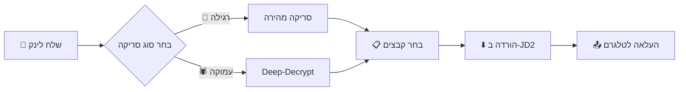

# 🎬 Siphon - JDownloader 2 Telegram Bot

<div align="center">


**בוט טלגרם חכם להורדת וידאו דרך JDownloader 2 עם העלאה אוטומטית לטלגרם**

</div>

---

## ✨ תכונות עיקריות

| תכונה | תיאור |
|--------|--------|
| 🔗 **אינטגרציה עם JDownloader 2** | שליטה מלאה על JD2 דרך My.JDownloader API |
| 🚀 **סריקה רגילה ועמוקה** | Deep-Decrypt לחילוץ לינקים מוסתרים |
| 📊 **דשבורד התקדמות** | מעקב בזמן אמת עם סרגל ירח מונפש |
| 📤 **העלאה אוטומטית** | העלאה ישירה לטלגרם עם תמיכה בסטרימינג |
| 🔪 **פיצול קבצים גדולים** | פיצול אוטומטי לקבצים מעל 2GB |
| 🔄 **המרה ל-MP4** | המרה אוטומטית לפורמט תואם סטרימינג |
| 🖼️ **תמיכה באלבומי תמונות** | שליחת תמונות כאלבום (עד 10 בכל פעם) |
| 🔒 **הרשאות משתמשים** | מנהלים ומשתמשים מורשים בלבד |

---

## 🛠️ דרישות מערכת

- **Python 3.8+**
- **JDownloader 2** עם חשבון [My.JDownloader](https://my.jdownloader.org/)
- **FFmpeg** מותקן ונגיש ב-PATH
- חשבון Telegram API

---

## 🚀 התקנה

### 1. שכפל את הפרויקט
```bash
git clone https://github.com/your-username/siphon.git
cd siphon
```

### 2. צור סביבה וירטואלית
```bash
python -m venv venv
venv\Scripts\activate  # Windows
# או
source venv/bin/activate  # Linux/Mac
```

### 3. התקן תלויות
```bash
pip install -r requirements.txt
```

### 4. הגדר את קובץ `.env`
צור קובץ `.env` בתיקייה הראשית:
```env
# Telegram
BOT_TOKEN=your_bot_token
API_ID=your_api_id
API_HASH=your_api_hash
ADMIN_IDS=123456789
USER_IDS=111111111,222222222

# JDownloader 2
JD_EMAIL=your_myjdownloader_email
JD_PASSWORD=your_myjdownloader_password
JD_DEVICE_NAME=your_device_name
JD_DOWNLOAD_DIR=C:\Users\you\Downloads\JD
```

---

## ⚙️ הגדרת JDownloader 2

1. **הורד והתקן** [JDownloader 2](https://jdownloader.org/jdownloader2)
2. **צור חשבון** ב-[My.JDownloader](https://my.jdownloader.org/)
3. **התחבר** ב-JD2: `Settings → My.JDownloader`
4. **שים לב לשם המכשיר** (Device Name) - זה מה שתכניס ב-`JD_DEVICE_NAME`

---

## 🤖 שימוש

### הפעלת הבוט
```bash
python bot.py
```
או:
```bash
run_bot.bat
```

### פקודות זמינות

| פקודה | תיאור |
|--------|--------|
| `/start` | התחלה והצגת הודעת ברוכים הבאים |

### תהליך העבודה



1. **שלח לינק** → הבוט מזהה אוטומטית
2. **בחר סוג סריקה** → רגילה (מהיר) או עמוקה (מקיף)
3. **בחר קבצים** → ממשק אינטראקטיבי עם Toggle
4. **לחץ Download** → JD2 מוריד, הבוט מעלה לטלגרם

---

## 📁 מבנה הפרויקט

```
Siphon/
├── 📄 bot.py           # הבוט הראשי + ממשק טלגרם
├── 📄 jd_client.py     # עטיפה ל-JDownloader API
├── 📄 utils.py         # פונקציות עזר (FFmpeg, פורמטים)
├── 📄 requirements.txt # תלויות Python
├── 📄 run_bot.bat      # סקריפט הרצה (Windows)
├── 📄 .env             # הגדרות סביבה (לא ב-Git)
└── 📄 README.md        # אתה כאן! 👋
```

---

## 🎨 תכונות ממשק

### 🌙 סרגל התקדמות ירח
```
🌕🌕🌕🌕🌖🌑🌑🌑🌑🌑 45%
```

### 📊 דשבורד הורדה
```
📥 מוריד... (סה"כ)
━━━━━━━━━━━━━━━━━━
🌕🌕🌕🌕🌖🌑🌑🌑🌑🌑 45.2%
📊 4.0GB/8.9GB
📥 קובץ נוכחי: video_file.mp4
⚡ מהירות: 15.3MB/s
⏱️ זמן משוער: 05:23
🗂 קבצים: 2/5
━━━━━━━━━━━━━━━━━━
```

---

## 📦 תלויות

| חבילה | תיאור |
|--------|--------|
| `pyrogram` | Telegram Client API |
| `myjdapi` | JDownloader 2 API |
| `ffmpeg-python` | עטיפה ל-FFmpeg |
| `python-dotenv` | טעינת משתני סביבה |

---

## ⚠️ הערות חשובות

> [!IMPORTANT]
> **JDownloader 2 חייב לרוץ ברקע** כדי שהבוט יעבוד!

> [!TIP]
> השתמש בסריקה עמוקה (Deep) לאתרים עם הגנות או לינקים מוסתרים.

> [!NOTE]
> קבצים מעל 2GB יפוצלו אוטומטית לחלקים.

---

## 📜 רישיון

MIT License - ראה [LICENSE](LICENSE) לפרטים.

---

<div align="center">

**Made with ❤️ by Omer**

</div>
