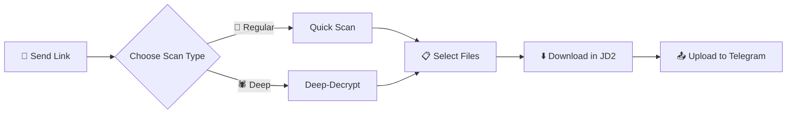

# 🎬 Siphon - JDownloader 2 Telegram Bot

<div align="center">


**Smart Telegram bot for video downloading via JDownloader 2 with automatic upload to Telegram**

</div>

---

## ✨ Key Features

| Feature | Description |
|---------|-------------|
| 🔗 **JDownloader 2 Integration** | Full control over JD2 via My.JDownloader API |
| 🚀 **Regular & Deep Scanning** | Deep-Decrypt for extracting hidden links |
| 📊 **Progress Dashboard** | Real-time tracking with animated moon progress bar |
| 📤 **Automatic Upload** | Direct upload to Telegram with streaming support |
| 🔪 **Large File Splitting** | Automatic splitting for files over 2GB |
| 🔄 **MP4 Conversion** | Automatic conversion to streaming-compatible format |
| 🖼️ **Photo Album Support** | Send photos as albums (up to 10 at a time) |
| 🔒 **User Permissions** | Admins and authorized users only |

---

## 🛠️ System Requirements

- **Python 3.8+**
- **JDownloader 2** with a [My.JDownloader](https://my.jdownloader.org/) account
- **FFmpeg** installed and accessible in PATH
- Telegram API account

---

## 🚀 Installation

### 1. Clone the project
```bash
git clone https://github.com/your-username/siphon.git
cd siphon
```

### 2. Create a virtual environment
```bash
python -m venv venv
venv\Scripts\activate  # Windows
# or
source venv/bin/activate  # Linux/Mac
```

### 3. Install dependencies
```bash
pip install -r requirements.txt
```

### 4. Configure the `.env` file
Create a `.env` file in the root directory:
```env
# Telegram
BOT_TOKEN=your_bot_token
API_ID=your_api_id
API_HASH=your_api_hash
ADMIN_IDS=123456789
USER_IDS=111111111,222222222

# JDownloader 2
JD_EMAIL=your_myjdownloader_email
JD_PASSWORD=your_myjdownloader_password
JD_DEVICE_NAME=your_device_name
JD_DOWNLOAD_DIR=C:\Users\you\Downloads\JD
```

---

## ⚙️ JDownloader 2 Setup

1. **Download and install** [JDownloader 2](https://jdownloader.org/jdownloader2)
2. **Create an account** at [My.JDownloader](https://my.jdownloader.org/)
3. **Connect** in JD2: `Settings → My.JDownloader`
4. **Note the Device Name** - this is what you'll enter in `JD_DEVICE_NAME`

---

## 🤖 Usage

### Running the bot
```bash
python bot.py
```
Or:
```bash
run_bot.bat
```

### Available Commands

| Command | Description |
|---------|-------------|
| `/start` | Start and display welcome message |

### Workflow



1. **Send a link** → Bot detects automatically
2. **Choose scan type** → Regular (fast) or Deep (comprehensive)
3. **Select files** → Interactive interface with Toggle
4. **Click Download** → JD2 downloads, bot uploads to Telegram

---

## 📁 Project Structure

```
Siphon/
├── 📄 bot.py           # Main bot + Telegram interface
├── 📄 jd_client.py     # JDownloader API wrapper
├── 📄 utils.py         # Helper functions (FFmpeg, formats)
├── 📄 requirements.txt # Python dependencies
├── 📄 run_bot.bat      # Run script (Windows)
├── 📄 .env             # Environment settings (not in Git)
└── 📄 README.md        # You are here! 👋
```

---

## 🎨 Interface Features

### 🌙 Moon Progress Bar
```
🌕🌕🌕🌕🌖🌑🌑🌑🌑🌑 45%
```

### 📊 Download Dashboard
```
📥 Downloading... (Total)
━━━━━━━━━━━━━━━━━━
🌕🌕🌕🌕🌖🌑🌑🌑🌑🌑 45.2%
📊 4.0GB/8.9GB
📥 Current file: video_file.mp4
⚡ Speed: 15.3MB/s
⏱️ ETA: 05:23
🗂 Files: 2/5
━━━━━━━━━━━━━━━━━━
```

---

## 📦 Dependencies

| Package | Description |
|---------|-------------|
| `pyrogram` | Telegram Client API |
| `myjdapi` | JDownloader 2 API |
| `ffmpeg-python` | FFmpeg wrapper |
| `python-dotenv` | Environment variables loader |

---

## ⚠️ Important Notes

> [!IMPORTANT]
> **JDownloader 2 must be running in the background** for the bot to work!

> [!TIP]
> Use Deep scanning for sites with protections or hidden links.

> [!NOTE]
> Files over 2GB will be automatically split into parts.

---

## 📜 License

MIT License - See [LICENSE](LICENSE) for details.

---

<div align="center">

**Made with ❤️ by Omer**

</div>
